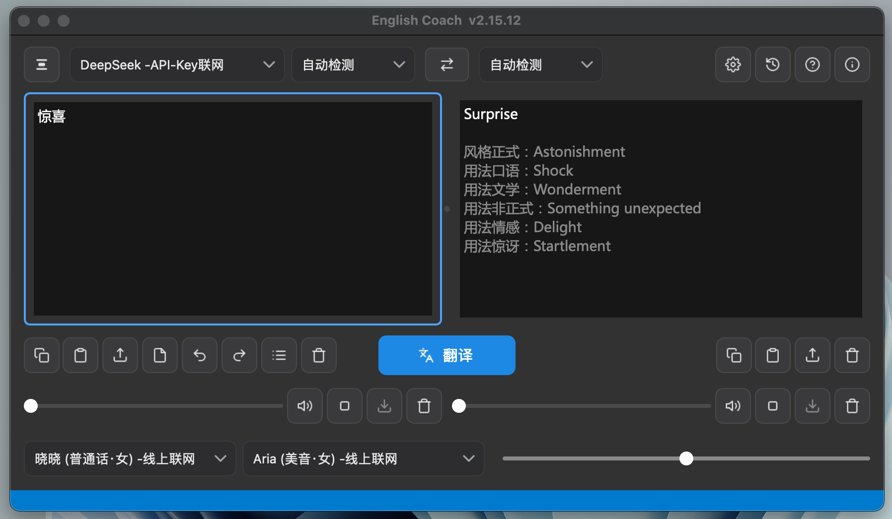

# English Coach 英语导师

> 中英翻译 + 语音朗读 + 卡拉OK字幕的桌面应用
> A desktop app for Chinese-English translation, text-to-speech and karaoke-style subtitles.

**当前版本 / Current version: v2.15.12**



---

## 下载 / Download

前往 **[Releases 页面](https://github.com/StrilenLiu/EnglishCoach/releases/latest)** 下载最新版，或直接点下表对应平台：

Grab the latest build from the **[Releases page](https://github.com/StrilenLiu/EnglishCoach/releases/latest)**, or use the direct links below:

| 平台 / Platform | 下载 / Download | 说明 / Notes |
|---|---|---|
| **Windows (CPU)** | [EnglishCoach-2.15.12-Windows-x64-CPU.zip](https://github.com/StrilenLiu/EnglishCoach/releases/download/v2.15.12/EnglishCoach-2.15.12-Windows-x64-CPU.zip) | 通用版，推荐大多数用户<br>The general build — recommended for most users |
| **Windows (GPU)** | [分卷 1 / part 1](https://github.com/StrilenLiu/EnglishCoach/releases/download/v2.15.12/EnglishCoach-2.15.12-Windows-x64-GPU.7z.001) · [分卷 2 / part 2](https://github.com/StrilenLiu/EnglishCoach/releases/download/v2.15.12/EnglishCoach-2.15.12-Windows-x64-GPU.7z.002) · [分卷 3 / part 3](https://github.com/StrilenLiu/EnglishCoach/releases/download/v2.15.12/EnglishCoach-2.15.12-Windows-x64-GPU.7z.003) · [分卷 4 / part 4](https://github.com/StrilenLiu/EnglishCoach/releases/download/v2.15.12/EnglishCoach-2.15.12-Windows-x64-GPU.7z.004) | **四个分卷需全部下载**到同一目录，再右键第一个分卷用 7-Zip 解压<br>**All four parts are required** — download them into the same folder, then extract the first part with 7-Zip |
| **macOS (Intel)** | [EnglishCoach-2.15.12-MacOS-Intel.dmg](https://github.com/StrilenLiu/EnglishCoach/releases/download/v2.15.12/EnglishCoach-2.15.12-MacOS-Intel.dmg) | Intel 芯片，macOS 11 Big Sur 起<br>Intel Macs, macOS 11 Big Sur and newer |
| **macOS (Apple Silicon)** | [EnglishCoach-2.15.12-MacOS-AppleSilicon.dmg](https://github.com/StrilenLiu/EnglishCoach/releases/download/v2.15.12/EnglishCoach-2.15.12-MacOS-AppleSilicon.dmg) | M 系列芯片原生运行，macOS 12 起<br>Native on M-series chips, macOS 12 and newer |
| **Linux** | [EnglishCoach-2.15.12-Linux-x64.tar.gz](https://github.com/StrilenLiu/EnglishCoach/releases/download/v2.15.12/EnglishCoach-2.15.12-Linux-x64.tar.gz) | glibc 2.31 起（Ubuntu 20.04 及以上）<br>glibc 2.31 and newer (Ubuntu 20.04-era and later) |

> 上面的链接指向 v2.15.12。以后发布新版时，[Releases 页面](https://github.com/StrilenLiu/EnglishCoach/releases/latest)总是指向最新版本。
>
> The links above point at v2.15.12. The [Releases page](https://github.com/StrilenLiu/EnglishCoach/releases/latest) always resolves to the newest build.

---

## 简介 / Overview

English Coach 是一款桌面翻译与朗读工具：14 个翻译引擎（含 10 个大模型引擎）、双语音合成后端（在线 edge-tts / 离线 Kokoro）、逐词卡拉OK字幕、原文译文选区联动、翻译历史与文件导入导出。界面支持中英双语与深浅主题。

English Coach is a desktop translation and speech tool. It bundles 14 translation engines — 10 of them powered by large language models — two text-to-speech backends (online edge-tts and offline Kokoro), word-by-word karaoke subtitles driven by real timestamps, two-way selection linking between the source and target panes, a searchable translation history, and file import/export. The interface is fully bilingual (Chinese/English) and follows light or dark themes.

---

## 用户须知 / For Users

### 下载即用，无需配置环境 / Download and run — no setup

**无需安装 Python、依赖库或 conda** —— 解释器与全部依赖已打包进程序，下载解压后双击即可运行。

**No Python, no dependencies, no conda required.** The interpreter and every library are bundled into the app. Download the archive for your platform, unpack it, and double-click to run. Nothing is installed system-wide, and removing the folder removes the program.

### 系统要求 / System Requirements

| 平台 / Platform | 要求 / Requirement |
|---|---|
| **macOS (Intel)** | macOS 11.0 Big Sur 或更新<br>macOS 11.0 Big Sur or newer |
| **macOS (Apple Silicon)** | macOS 12.0 或更新，原生 arm64<br>macOS 12.0 or newer, native arm64 |
| **Windows** | 64 位 Windows 10 / 11<br>64-bit Windows 10 or 11 |
| **Linux** | glibc 2.31 或更新（Ubuntu 20.04 及以上同级发行版）<br>glibc 2.31 or newer (Ubuntu 20.04-era distributions and later) |
| **磁盘空间 / Disk** | 建议预留 2–3GB（含离线朗读模型）<br>Allow 2–3GB including the offline speech model |

**GPU 版 / GPU edition**：打包了 CUDA 组件，体积明显更大（分卷压缩上传），仅在有 NVIDIA 显卡的 Windows 机器上才有意义。没有独立显卡请下载 CPU 版。

**GPU edition**: bundles CUDA components and is considerably larger, so it is uploaded as a multi-part archive. It is only worth downloading on a Windows machine with an NVIDIA graphics card — otherwise use the CPU edition, which has identical features and merely runs offline speech synthesis more slowly.

### 各平台安装与启动 / Installing and launching

每个平台的压缩包内都附带了**安装与卸载脚本**，运行后会把程序放到系统的标准位置并创建快捷方式/菜单入口，卸载时也能一并清理干净。不想安装的话，直接运行程序本体同样可以。

Every platform archive ships with **install and uninstall scripts**. Running the installer places the program in the standard location for your system and creates a shortcut or menu entry; the uninstaller removes everything cleanly. You can also just run the program in place without installing.

| 平台 / Platform | 安装 / Install | 卸载 / Uninstall |
|---|---|---|
| Windows | 双击 `Install.bat` | 双击 `Uninstall.bat` |
| macOS | 双击 `Install.command` | 双击 `Uninstall.command` |
| Linux | `./Install.sh` | `./Uninstall.sh` |

卸载脚本默认**保留**你的翻译历史、设置与 API Key，运行时会单独询问是否一并删除。

The uninstallers **keep** your translation history, settings and API keys by default, and ask separately before deleting them.

**Windows**

双击 `Install.bat` 安装到「开始」菜单（可选桌面快捷方式，无需管理员权限），或直接双击 `EnglishCoach.exe` 免安装运行。

Double-click `Install.bat` to install with a Start Menu entry and an optional Desktop shortcut — no administrator rights needed — or just double-click `EnglishCoach.exe` to run it in place.

解压后双击 `EnglishCoach.exe` 即可。GPU 版为分卷压缩包，请把所有分卷（`.7z.001`、`.7z.002` …）下载到**同一目录**，然后右键第一个分卷用 7-Zip 解压。

Unpack the archive and double-click `EnglishCoach.exe`. The GPU edition ships as a multi-part 7-Zip archive: download **every** part (`.7z.001`, `.7z.002`, …) into the **same folder**, then right-click the first part and extract with 7-Zip. Extracting only the first part will fail.

**macOS**

请按芯片类型选择下载：Intel 机型选 `MacOS-Intel`，M 系列芯片选 `MacOS-AppleSilicon`。Apple Silicon 版为原生运行，不需要 Rosetta。

Choose the download that matches your chip: `MacOS-Intel` for Intel Macs, `MacOS-AppleSilicon` for M-series Macs. The Apple Silicon build runs natively and does not need Rosetta.

双击下载得到的 `.dmg` 挂载后，有两种安装方式：

Double-click the downloaded `.dmg` to mount it. There are two ways to install:

- **双击 `Install.command`（推荐）** —— 自动复制到「应用程序」并**移除隔离标记**。本程序未做代码签名，不移除的话首次打开会被系统拦截，提示「已损坏」或「无法验证开发者」。
  **Double-click `Install.command` (recommended)** — it copies the app into Applications and **removes the quarantine flag**. The app is unsigned, so without this macOS blocks the first launch with a "damaged" or "unverified developer" message.
- **手动拖拽** —— 把 `English Coach.app` 拖入「应用程序」文件夹。此时需要自己处理隔离标记，见下方[常见问题](#常见问题--troubleshooting)。
  **Drag manually** — drag `English Coach.app` into your Applications folder. You will then need to clear the quarantine flag yourself; see [Troubleshooting](#常见问题--troubleshooting) below.

安装完成后可推出（弹出）磁盘映像，并删除 `.dmg` 文件。

Once installed you can eject the disk image and delete the `.dmg` file.

**Linux**

下载 `EnglishCoach-<版本>-Linux-x64.tar.gz`，解压后运行启动脚本：

Download `EnglishCoach-<version>-Linux-x64.tar.gz`, extract it, and run the launcher script:

```bash
tar -xzf EnglishCoach-2.15.12-Linux-x64.tar.gz
cd EnglishCoach-2.15.12-Linux-x64
chmod +x EnglishCoach        # 首次运行前加执行权限 / make it executable once
./EnglishCoach
```

若提示缺少系统库，请按发行版安装 Qt 运行所需的组件：

If the program reports a missing system library, install the components Qt needs for your distribution:

```bash
# Debian / Ubuntu
sudo apt install libxcb-cursor0 libxcb-xinerama0 libxkbcommon-x11-0 libgl1

# Fedora / RHEL
sudo dnf install xcb-util-cursor libxkbcommon-x11 mesa-libGL

# Arch
sudo pacman -S xcb-util-cursor libxkbcommon-x11
```

其中 `libxcb-cursor0` 是最常见的缺失项 —— Qt 6 必须依赖它，而许多桌面环境默认不装。

`libxcb-cursor0` is by far the most common missing piece: Qt 6 requires it, yet many desktop environments do not install it by default.

想在应用菜单里显示图标，可自建一个桌面项：

To make the app appear in your application menu, create a desktop entry:

```bash
cat > ~/.local/share/applications/englishcoach.desktop << EOF
[Desktop Entry]
Type=Application
Name=English Coach
Exec=/绝对路径/EnglishCoach
Icon=/绝对路径/icon_1024.png
Categories=Education;Utility;
EOF
```

### 未签名应用提示 / Unsigned App Warning

本程序未做代码签名（Apple 开发者证书为年费制），首次打开可能被系统拦截：

This app is not code-signed — Apple's Developer ID requires a paid yearly membership — so the system may block it on first launch:

- **macOS**：「系统设置 → 隐私与安全性」点『仍要打开』，或在终端执行下面这条命令移除隔离标记。
  Go to System Settings → Privacy & Security and click **Open Anyway**, or remove the quarantine flag from Terminal:
  ```bash
  sudo xattr -rd com.apple.quarantine "/Applications/English Coach.app"
  ```
- **Windows**：SmartScreen 提示时点『更多信息 → 仍要运行』。
  At the SmartScreen prompt, click **More info → Run anyway**.
- **Linux**：无签名机制，只需确认文件有执行权限。
  Linux has no equivalent gatekeeper; just make sure the file is executable.

### 哪些需要联网 / What Needs a Network Connection

| 类别 / Category | 说明 / Details |
|---|---|
| **已打包，立即可用**<br>Bundled, works immediately | 程序本体与全部依赖库<br>The program itself and every bundled library |
| **首次使用下载一次**<br>Downloaded once on first use | Kokoro 离线朗读模型（约 330MB）、Argos 离线语言包；下载后完全离线<br>The Kokoro offline speech model (~330MB) and Argos language packs; fully offline afterwards |
| **始终需要联网**<br>Always needs a network | 在线翻译引擎、在线朗读<br>Online translation engines and online text-to-speech |
| **需自备 API Key**<br>Requires your own API key | LLM 引擎在云端运行，本地不打包任何大模型<br>LLM engines run in the cloud; no language model is bundled locally |

### 中国大陆用户须知 / Notes for Users in Mainland China

- **无需 VPN 即可使用**：国内 LLM 引擎（DeepSeek、文心一言、豆包、通义千问、混元、智谱 GLM）与 Argos 离线语言包。
  **Works without a VPN**: the Chinese LLM engines (DeepSeek, ERNIE, Doubao, Qwen, Hunyuan and GLM) and the Argos offline language packs are all reachable directly.
- **Kokoro 朗读模型**：托管在 Hugging Face，大陆无法直连。程序会按系统区域自动改用 `hf-mirror.com` 公益镜像，通常无需 VPN 即可完成首次下载；如需指定其它镜像，设置环境变量 `HF_ENDPOINT` 即可覆盖。
  **The Kokoro speech model** is hosted on Hugging Face, which is not directly reachable from mainland China. The app detects the system region and automatically falls back to the `hf-mirror.com` community mirror, so the one-time download normally succeeds without a VPN. Set the `HF_ENDPOINT` environment variable to point at a different mirror.
- **需要 VPN**：Google 翻译、DeepL 翻译，以及在线朗读（微软 Edge 嗓音）。
  **Needs a VPN**: Google Translate, DeepL, and online text-to-speech (Microsoft Edge voices).

---

## 常见问题 / Troubleshooting

### Linux：启动时报 `qt.qpa.plugin` 错误 / Qt platform plugin errors on Linux

若看到类似下面的报错，说明系统缺少 Qt 需要的库：

If you see an error like the one below, your system is missing a library that Qt needs:

```
qt.qpa.plugin: From 6.5.0, xcb-cursor0 or libxcb-cursor0 is needed to load
the Qt xcb platform plugin.
This application failed to start because no Qt platform plugin could be initialized.
```

v2.15.12 起产物已捆绑常缺的 xcb 支持库，多数情况下不会再遇到。万一仍然出现，按发行版执行：

Since v2.15.12 the build bundles the commonly-missing xcb libraries, so this should be rare. If it still happens, install them for your distribution:

```bash
# Debian / Ubuntu
sudo apt update && sudo apt install -y libxcb-cursor0 libxkbcommon-x11-0 libgl1

# Fedora / RHEL
sudo dnf install -y xcb-util-cursor libxkbcommon-x11 mesa-libGL

# Arch
sudo pacman -S xcb-util-cursor libxkbcommon-x11
```

用启动脚本 `English Coach.sh` 运行时，程序会**在启动前自动检查**并直接给出适配你系统的安装命令，不必自己判断缺什么。

When launched through `English Coach.sh` the program **checks these libraries before starting** and prints the exact install command for your distribution, so you do not have to work out what is missing.

### Linux：有 `pipewire` 警告但程序正常 / pipewire warnings on Linux

```
qt.multimedia.symbolsresolver: Couldn't load pipewire-0.3 library
```

这只是 Qt 在探测音频后端，找不到 PipeWire 会自动回退到 PulseAudio 或 ALSA。**只要朗读有声音就可以忽略。**

This is only Qt probing for an audio backend; without PipeWire it falls back to PulseAudio or ALSA. **If playback works, ignore it.**

确实没有声音时再安装（包名随系统版本不同）：

Only if you actually get no sound, install it — the package name varies by release:

```bash
sudo apt install -y libpipewire-0.3-0t64   # Ubuntu 24.04 及更新 / and newer
sudo apt install -y libpipewire-0.3-0      # Ubuntu 22.04 及更早 / and older
```

若提示找不到软件包，先 `sudo apt update`；仍找不到就用 `apt-cache search pipewire | grep ^libpipewire` 查看你的系统里实际叫什么。

If apt reports no such package, run `sudo apt update` first; if it still cannot be found, use `apt-cache search pipewire | grep ^libpipewire` to see the actual name on your system.

### macOS：提示「已损坏」或无法打开 / macOS says the app is damaged or refuses to open

本程序未做代码签名。**双击 `Install.command` 安装即可自动解决**（它会移除隔离标记）。若手动拖入「应用程序」，请执行：

The app is not code-signed. **Double-clicking `Install.command` handles this automatically** by removing the quarantine flag. If you copied the app manually instead, run:

```bash
sudo xattr -rd com.apple.quarantine "/Applications/English Coach.app"
```

### Windows：SmartScreen 拦截 / SmartScreen blocks the app

点「更多信息 → 仍要运行」。这是未签名程序的常规提示，与安全性无关。

Click **More info → Run anyway**. This is the standard prompt for unsigned software and does not indicate a problem with the program.

### 首次朗读要等很久 / The first playback takes a long time

Kokoro 离线朗读模型约 330MB，首次使用时下载，之后完全离线。中国大陆会自动改用 `hf-mirror.com` 镜像。

The Kokoro offline speech model is about 330MB and is downloaded on first use, after which it works entirely offline. Users in mainland China are automatically switched to the `hf-mirror.com` mirror.

### 程序无法启动且没有任何提示 / The app fails to start silently

查看运行日志，其中记录了未捕获的异常：

Check the runtime log, which records uncaught exceptions:

- Windows：`%APPDATA%\EnglishCoach\运行日志.txt`
- macOS：`~/Library/Application Support/EnglishCoach/运行日志.txt`
- Linux：`~/.local/share/EnglishCoach/运行日志.txt`

---

## 主要功能 / Features

- **14 个翻译引擎 / 14 translation engines**
  Google（免费）、Google Cloud、DeepL、Argos（离线），以及 DeepSeek、GPT、Gemini、Claude、GLM、文心一言、豆包、通义千问、Kimi、混元。
  Google (free), Google Cloud, DeepL and Argos (fully offline), plus ten LLM engines: DeepSeek, GPT, Gemini, Claude, GLM, ERNIE, Doubao, Qwen, Kimi and Hunyuan. Each engine keeps its own API key, and you can switch between them at any time.
- **多风格翻译 / Multi-style translation**
  LLM 引擎下同时给出书面、口语、俚语、美式英式等多种译法。
  With an LLM engine selected, one request returns several renderings at once — formal, conversational, idiomatic, and American versus British — so you can compare register rather than settle for a single output.
- **双语音后端 / Dual TTS backends**
  edge-tts（在线，多语言嗓音）与 Kokoro（离线，本地推理）。
  edge-tts provides a wide range of online voices across languages, while Kokoro runs entirely on your machine after its first download — useful offline, and free of any per-character quota.
- **卡拉OK字幕 / Karaoke subtitles**
  按真实词级时间戳逐词高亮，支持选区朗读与进度条拖动定位。
  Words highlight one by one against real word-level timestamps rather than an estimated pace. You can read aloud just a selection, and dragging the progress slider re-renders the highlight at the matching word.
- **选区联动 / Selection linking**
  选中一侧文字，另一侧自动高亮对应内容。
  Selecting text in one pane highlights the corresponding span in the other, which makes it easy to check how a particular phrase was rendered.
- **文件导入导出 / File import & export**
  txt / docx / pdf 导入，txt / md / docx / json / pdf 导出。
  Import from txt, docx and pdf; export to txt, md, docx, json and pdf, with the source and translation kept side by side.
- **翻译历史 / Translation history**
  按天分组、可重新载入与导出。
  Entries are grouped by day, can be reloaded into the editor, and can be exported as a whole.
- **界面 / Interface**
  中英双语、深浅主题跟随系统、极简模式、窗口置顶。
  Bilingual interface, light and dark themes that can follow the system, a compact minimal mode, and an always-on-top option.

---

## 从源码运行 / Running from Source

```bash
# 1. 创建环境（推荐 Python 3.10+）
#    Create an environment (Python 3.10 or newer recommended)
conda create -n EnglishCoach python=3.10
conda activate EnglishCoach

# 2. 安装运行依赖 / Install runtime dependencies
pip install -r requirements.txt

# 3. 安装 spaCy 英文模型（Kokoro 分词需要，pip 索引中没有）
#    Install the spaCy English model (needed by Kokoro, not on PyPI)
pip install https://github.com/explosion/spacy-models/releases/download/en_core_web_sm-3.7.1/en_core_web_sm-3.7.1-py3-none-any.whl

# 4. 运行 / Run
python english_coach.py
```

**Windows GPU 用户**：先装 CUDA 版 torch，再装其余依赖，避免被 CPU 版覆盖。

**Windows GPU users**: install CUDA torch first so the CPU wheel cannot overwrite it, then the rest:

```bash
pip install -r requirements-gpu.txt
pip install -r requirements.txt
```

### 依赖文件说明 / About the requirements files

| 文件 / File | 用途 / Purpose |
|---|---|
| `requirements.txt` | 运行本程序所需的全部库，已用平台标记区分 Windows / macOS / Linux<br>Everything needed to run the app, with environment markers separating Windows, macOS and Linux |
| `requirements-build.txt` | 额外的打包工具（PyInstaller、Pillow），仅自行编译时需要<br>Extra packaging tools (PyInstaller, Pillow) — only needed when building installers |
| `requirements-gpu.txt` | Windows + NVIDIA 显卡专用的 CUDA 版 torch<br>CUDA torch for Windows machines with an NVIDIA GPU |

平台差异已写进 `requirements.txt` 的标记，无需手动挑选：Intel Mac 会拿到钉死的 PyQt6 6.4.2（兼容 Big Sur），Apple Silicon、Windows 与 Linux 拿最新版；`pyobjc-framework-Cocoa` 只在 macOS 上安装。

Platform differences are encoded as markers, so you do not need to pick anything by hand: Intel Macs receive the pinned PyQt6 6.4.2 that keeps Big Sur support, while Apple Silicon, Windows and Linux take the current release, and `pyobjc-framework-Cocoa` installs on macOS only.

**关于版本钉死 / On the pinned versions**：`torch`、`transformers`、`ctranslate2` 的版本组合经过实机验证，随意升级很可能破坏 Kokoro 离线朗读或 Argos 离线翻译。

The `torch`, `transformers` and `ctranslate2` versions are pinned to a combination validated on real machines. Upgrading them casually is likely to break Kokoro offline speech or Argos offline translation.

---

## 自行编译 / Building

仓库内含四个构建脚本，版本号自动从 `english_coach.py` 的 `APP_VERSION` 提取：

Four build scripts are included. Each extracts the version automatically from `APP_VERSION` in `english_coach.py`, so you never edit a version string in two places:

| 脚本 / Script | 产物 / Output |
|---|---|
| `Build MacOS.sh` | `dist/MacOS-Intel/` 或 `dist/MacOS-AppleSilicon/`（按 `uname -m` 自动判断）<br>`dist/MacOS-Intel/` or `dist/MacOS-AppleSilicon/`, selected automatically via `uname -m` |
| `Build Windows.bat` | `dist/Windows-x64-CPU/` |
| `Build Windows GPU.bat` | `dist/Windows-x64-GPU/`（CUDA）<br>`dist/Windows-x64-GPU/` (CUDA) |
| `Build Linux.sh` | `dist/Linux-x64/` 与 tar.gz 压缩包<br>`dist/Linux-x64/` plus a tar.gz archive |

**PyInstaller 不支持交叉编译** —— 每个平台的产物必须在该平台上编译。

**PyInstaller cannot cross-compile.** Each platform's binary must be produced on that platform: build the Windows editions on Windows, the macOS editions on the matching Mac, and the Linux build on Linux.

**Windows 编译提示 / Windows build note**：若 `ctranslate2` 导入失败，请先安装
[Visual C++ Redistributable (x64)](https://learn.microsoft.com/cpp/windows/latest-supported-vc-redist)。

If `ctranslate2` fails to import during the build, install the Visual C++ Redistributable (x64) first.

**Linux 编译提示 / Linux build note**：建议在较老的发行版（如 Ubuntu 20.04、Debian 11）上编译。glibc 向下不兼容，用新系统编出的产物无法在老系统上运行，反之则可以。

Build on an older distribution such as Ubuntu 20.04 or Debian 11. glibc is forward-compatible but not backward-compatible, so a binary built on a new system will refuse to start on older ones, while a binary built on an old system runs everywhere newer.

没有老系统也不必重装 —— 用 Docker 即可，`python:3.10-bullseye` 是 Debian 11 底座（glibc 2.31）且自带 Python 3.10：

You do not need to reinstall anything to get an old base — Docker is enough. The `python:3.10-bullseye` image is Debian 11 (glibc 2.31) and ships Python 3.10:

```bash
docker run --rm -it -v "$PWD":/src -w /src python:3.10-bullseye bash
# 容器内 / inside the container:
apt update && apt install -y libgl1 libxkbcommon-x11-0 libegl1 zip \
    libxcb-cursor0 libxcb-image0 libxcb-util1 libxcb-render-util0
bash "Build Linux.sh"
```

后面那四个 `libxcb-*` 是给产物**捆绑**用的（共约 94KB）：Qt 6.5+ 的 xcb 插件需要 `libxcb-cursor`，而多数发行版默认不装，用户一启动就会看到一堆 `qt.qpa.plugin` 报错。编译环境里装上它们，构建脚本会自动打进产物，用户端就不必再手动安装。注意 `libxcb.so.1`、`libX11`、`libc` 这类**不会**被捆绑 —— 它们必须与用户的 X 服务器和显卡驱动匹配，捆绑反而会引发难查的崩溃。

The four `libxcb-*` packages are there so the build can **bundle** them (about 94KB total). Qt 6.5+ needs `libxcb-cursor` for its xcb platform plugin, yet most distributions do not install it by default, so users otherwise hit a wall of `qt.qpa.plugin` errors on first launch. With these present in the build environment the script bundles them automatically and users no longer need to install anything by hand. Note that `libxcb.so.1`, `libX11` and `libc` are deliberately **not** bundled: those must match the user's X server and graphics drivers, and bundling them causes hard-to-diagnose crashes instead.

Windows 的 CMD 请把 `"$PWD"` 换成 `"%cd%"`，PowerShell 换成 `"${PWD}"`。产物会出现在宿主机的 `dist/Linux-x64/`。容器没有图形界面，无法在其中启动程序，但打包本身不需要界面 —— 请到有桌面的 Linux 上测试运行。

On Windows use `"%cd%"` in CMD or `"${PWD}"` in PowerShell instead of `"$PWD"`. The output appears in `dist/Linux-x64/` on the host. The container has no graphical environment so the app cannot be launched inside it, but packaging does not need one — test the result on a Linux machine with a desktop.

**PyQt6 版本钉死的原因 / Why PyQt6 is pinned**：脚本固定使用 PyQt6 6.9.1。6.10 起的 Linux 轮子是 `manylinux_2_34`，要求 glibc 2.34 以上，在 Debian 11 / Ubuntu 20.04 上装不了，pip 会退去下载源码包现场编译并因缺少 qmake 而失败。6.9.x 的轮子是 `manylinux_2_28`，是能装在 glibc 2.31 上的最新版本；改用 6.10+ 会把最低要求抬到 glibc 2.34，将 Ubuntu 20.04 与 22.04 的用户一并挡在门外。如需覆盖更老的系统，可用 `PYQT_VER=6.8.1 bash "Build Linux.sh"` 指定版本。

The script pins PyQt6 6.9.1. From 6.10 onwards the Linux wheels are `manylinux_2_34` and require glibc 2.34 or newer, which Debian 11 and Ubuntu 20.04 do not have — pip then falls back to the source archive and fails while building it because qmake is missing. The 6.9.x wheels are `manylinux_2_28`, making 6.9.1 the newest release installable on glibc 2.31. Moving to 6.10+ would raise the floor to glibc 2.34 and shut out Ubuntu 20.04 and 22.04 users alike. To reach even older systems, override the version with `PYQT_VER=6.8.1 bash "Build Linux.sh"`.

---

## 隐私 / Privacy

API Key 仅保存在本机（QSettings），不会上传。翻译历史与运行日志保存在系统用户数据目录（Windows `%APPDATA%`、macOS `~/Library/Application Support`、Linux `~/.local/share`）。程序不做任何遥测或使用统计。

API keys are stored locally through QSettings and are never transmitted anywhere except to the translation service you explicitly choose. Translation history and runtime logs live in the standard user-data directory for your system: `%APPDATA%` on Windows, `~/Library/Application Support` on macOS, and `~/.local/share` on Linux. The app performs no telemetry and collects no usage statistics.

---

## 支持作者 / Support the Author

如果这个程序对你有帮助，欢迎请作者喝杯咖啡：

If you find this program useful, you are welcome to buy the author a coffee:


**支付宝 / Alipay**

（更多打赏渠道正在准备中 / More options are being set up.）

---

## 许可与作者 / License & Author

- **许可 / License**：GPLv3
- **作者 / Author**：Strilen Liu
- **网站 / Website**：[www.strilen.com](https://www.strilen.com)
- **邮箱 / Email**：vfx@strilen.com

---

## 更新记录 / Changelog

完整的版本历史见 [CHANGELOG.md](CHANGELOG.md)，中英双语，涵盖全部 107 个版本。

The full bilingual version history is in [CHANGELOG.md](CHANGELOG.md), covering all 107 releases.

该文件由 `gen_changelog.py` 从 `english_coach.py` 里的 `CHANGELOG` 自动生成 —— 程序内的「关于 → 更新记录」与该文件读的是同一份数据，不会脱节。发布新版前运行：

The file is generated by `gen_changelog.py` from the `CHANGELOG` list inside `english_coach.py`, which is the same data the in-app "What's New" dialog reads, so the two can never drift apart. Before publishing a release, run:

```bash
python gen_changelog.py            # 重新生成 / regenerate
python gen_changelog.py --check    # 只检查是否最新 / check only
```

---

## 维护提示 / Maintenance Note

> **每次版本更新时，请同步更新本文件顶部的版本号、运行 `python gen_changelog.py` 重新生成 CHANGELOG.md，并检查上述说明是否仍然准确**（尤其是系统要求、模型下载方式、大陆访问情况与构建脚本产物名）。
>
> **On every release, update the version number at the top of this file** and verify that the notes above are still accurate — especially the system requirements, model download behaviour, mainland China access notes, and build script outputs.
